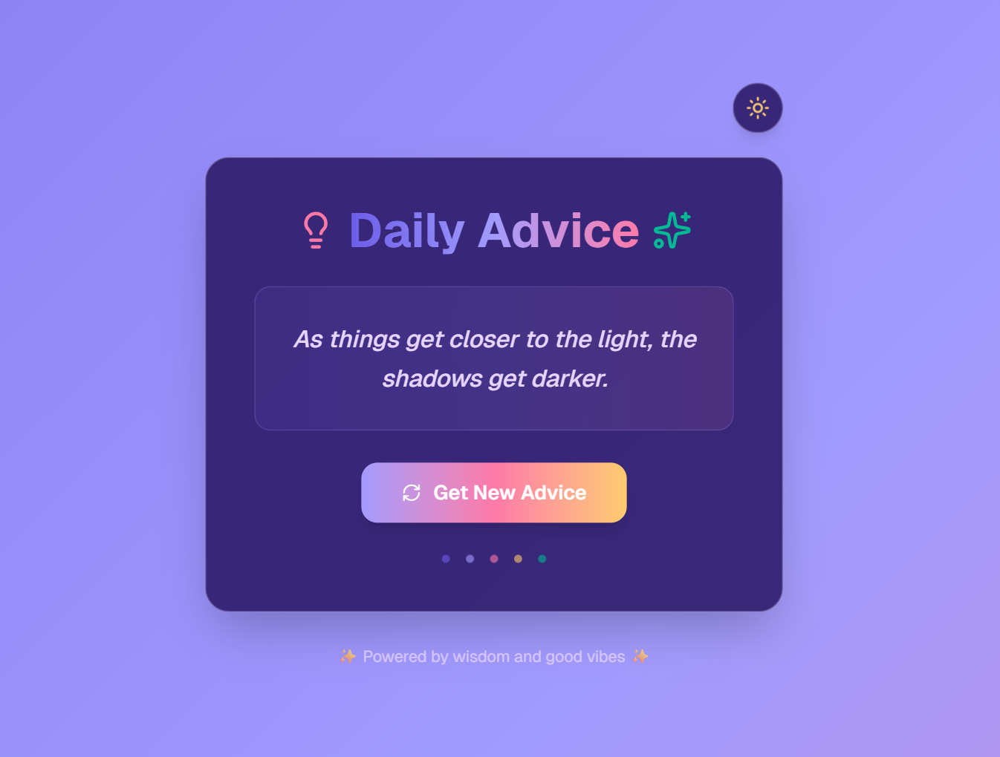

# 🌟 Advice Generator



🔗 **Live Demo:** [Advice Generator App](https://advice-generator-theta-ashy.vercel.app/)

---

## 📖 Project Overview
The **Advice Generator** is a fun little web app that fetches random pieces of advice from a public API and displays them in a clean, modern UI.  
Whenever you click the button 🎲, you’ll get a fresh piece of wisdom to brighten your day.

---

## 🚀 Features
- ✅ Fetches advice from a free public API  
- 🎨 Simple and responsive UI design  
- ⚡ Fast, lightweight, and beginner-friendly  
- 📱 Works on desktop & mobile  

---

## 🛠️ Tech Stack
- **HTML5** – structure of the app  
- **CSS3** – styling for a modern and clean look  
- **JavaScript** – logic for fetching and displaying advice  
- **API** – [Advice Slip JSON API](https://api.adviceslip.com/)  

---

## 📂 Project Structure
```
advice-generator/
├── index.html      # Main HTML file
├── style.css       # CSS styling
├── script.js       # JavaScript logic
├── advice.png      # Preview image
└── README.md       # Project documentation
```

---

## ▶️ How to Run Locally
1. Clone the repo  
   ```bash
   git clone https://github.com/raimonvibe/advice-generator.git
   ```
2. Open the folder  
   ```bash
   cd advice-generator
   ```
3. Open `index.html` in your browser  
   That’s it 🎉

---

## ✨ Future Improvements
- Save favorite advice quotes 💾  
- Add a share-to-social button 📢  
- Dark/Light theme toggle 🌗  

---

## 💡 Inspiration
Sometimes all you need is a single line of advice to spark new ideas or comfort you in tough times. This project is a playful way to mix coding practice with daily wisdom ✨

---

👨‍💻 Built with ❤️ by [RaimonVibe](https://github.com/raimonvibe)
